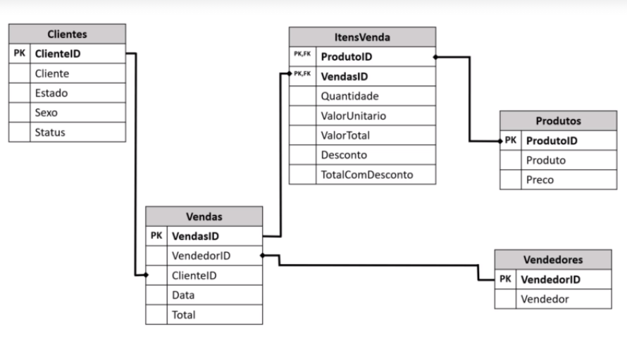

# Inicial

Olá! Este repositório terá o conteúdo utilizado no curso [Power BI para Todos: Fácil e Simples!](https://www.udemy.com/course/power-bi-para-todos-facil-e-simples/), disponível no site da Udemy. É um "esquenta" para a certificação PL-900 e as seguintes da Microsoft.

O caso de uso é simulando uma empresa de varejo. . Como identifiquei uma oportunidade para ingressar na área de BI, por hora vou focar nestes conteúdos para em breve fazer o exame da certificação PL-900. Assim que concluir a certificação, volto a alimentar os conteúdos dos outros repositórios. 

## [Material do curso para download](https://www.eia.ai/material_download)

## Relacionamentos entre Tabelas

## Perguntas

Com o Power BI, iremos responder estas perguntas de forma visual, intuitiva, para uma melhor tomada de decisão dos administradores.

* Quanto cada Status representa em vendas?
* Homens ou mulheres compram mais nossos produtos?
* Quais são nossos maiores clientes?
* Quem são nossos vendedores de maior volume?
* Quem são nossos vendedores de menor volume?
* Quanto nossos vendedores vendem por mês?
* Quais os produtos mais vendidos?
* Quais os produtos menos vendidos?
* Quais produtos recebem mais descontos?
* Quanto cada produto representa em vendas mensalmente? Aqui nos referimos ao percentual e não à quantidade. Para a quantidade em si, é a pergunta seguinte.
* Qual a quantidade de venda de cada produto por mês? Aqui nos referimos a quantidade.

## Relatório - [Link para baixar o arquivo](/RelatorioVarejo.pbix) 

## Conteúdo adicional

* Link para Baixar o [Power BI Desktop](https://powerbi.microsoft.com/pt-br/desktop/)

  

